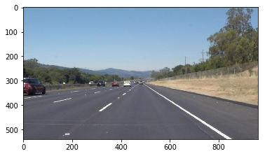
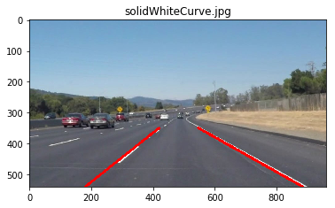

# **Finding Lane Lines on the Road** 

## Introduction

The goals of this project are the following:
* Make a pipeline that finds lane lines on the road
* Reflect on your work in a written report

[//]: # (Image References)

[image1]: ./examples/grayscale.jpg "Grayscale"

---

### Reflection
The pipeline is defined in four(4) steps:

1. Read the image or frame

2. Highlight sections of interest by converting the image to HSV color space and find regions in the ranges:
    
        low_boundary=(0,0,200)
        high_boundary=(255,150,255)
3. Select the interest region to focus only on the road and remove other possible noise
4. Find the lanes lines using HoughLinesP and draw complete lines 

When highlighting the sections of interest the HSV color space is used which helps with not having problems between yellow and white lines, they are processed equally.

To get the lines I use a naive approach, of first separate lines by the positive and negative slope. Afterward, I average the slope and intercept. To find the x,y values of the lines it is used the low and high numbers on the Y-axis from the interest Region. Then, using the average slope and the average intercept, the X values are calculated.

### 2. Identify potential shortcomings with your current pipeline
The issues identified with the actual solution are:
- Drawing the lines on the video is noisy, an option is to maintain the old points before each iteration, so if there is no point identified the line is not jumping.
- For the curves in the challenge video, the slopes can be restricted to a specific range so the lines do not cross
- Using vectorized solutions can contribute to better performance of the algorithm
- At present, the region of interest is fixed, so if the horizon changes the algorithm could get confused

### 3. Suggest possible improvements to your pipeline
- The solution can be improved by removing the blue on the sky
- Using vectorized solutions can contribute to better performance of the algorithm, such as using NumPy for the calculation
- Probably some linear regression can help with the lines
- I can imagine that the car can work with simple points for the lines since the car structure is fixed and the cameras too
